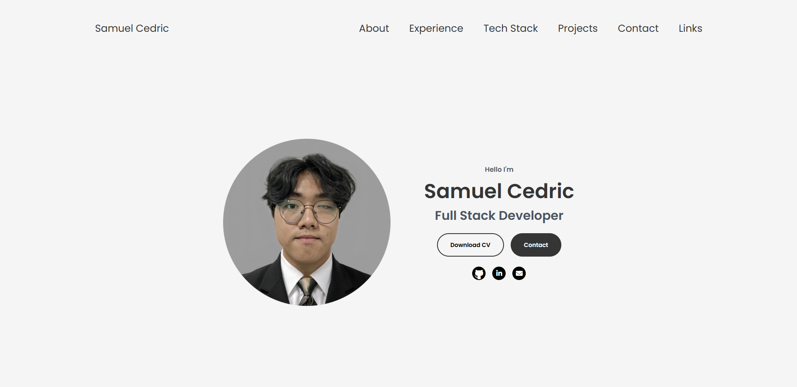

# portfolio

portfolio is a personal website showcasing my projects and skills, built using React, Vite, SWC, and TypeScript. The site serves as a digital resume and a platform to display my work, all while being easily deployable using Docker.

## Features
- **Project Showcases**: Highlighting various projects with descriptions and links to live demos.
- **Responsive Design**: Optimized for both desktop and mobile devices for an enhanced user experience.
- **Contact Form**: Allows visitors to reach out directly for inquiries or collaborations.
- **Skill Breakdown**: An overview of skills and technologies I'm proficient in, visually represented for easy understanding.

## Technologies Used
- React.js
- Vite
- SWC (Speedy Web Compiler)
- TypeScript
- Docker
## Installation
To get a local copy of Cedric's Portfolio, follow these steps:
1. **Clone the repository**:
git clone https://github.com/YourUsername/cedric-portfolio.git
2. **Navigate to the project directory**:
cd cedric-portfolio
3. **Install dependencies**:
If you are using npm:
npm install
4. **Run the application**:
npm start

## Docker Installation
For deployment using Docker, follow these steps:
1. **Build the Docker image**:
sudo docker build -t portfolio .
2. **Deploy the Docker container**:
sudo docker run -itd -p 3080:80 --name portfolio portfolio
## Contributing
Contributions are welcome! If you’d like to contribute to Cedric's Portfolio, please follow these steps:
1. Fork the project.
2. Create your feature branch (`git checkout -b feature/YourFeature`).
3. Commit your changes (`git commit -m 'Add some feature'`).
4. Push your branch (`git push origin feature/YourFeature`).
5. Open a pull request.
Please ensure your contributions adhere to coding standards and include appropriate documentation.

## License
This project is licensed under the MIT License - see the [LICENSE](https://choosealicense.com/licenses/mit/) file for details.

## Contact
For inquiries, suggestions, or feedback, please reach out to me at [ceds.sam@gmail.com](mailto:ceds.sam@gmail.com).

## Acknowledgments
Special thanks to all contributors, libraries, and resources that have supported the development of this project. Your assistance is greatly appreciated! Thank you for visiting my portfolio!
